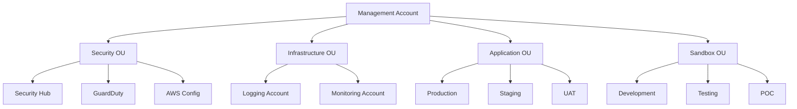
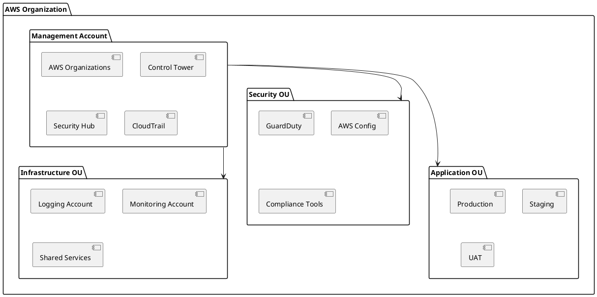

# Architecture Diagrams

This directory contains visual diagrams and flowcharts that illustrate the Enterprise Multi-Account AWS Organization architecture, components, and processes.

## Diagram Categories

### 1. System Architecture Diagrams
- **High-Level Architecture** - Overall system design and component relationships
- **Component Architecture** - Detailed view of individual components
- **Data Flow Architecture** - How data flows through the system
- **Integration Architecture** - External system integrations

### 2. Network Architecture Diagrams
- **VPC Design** - Virtual Private Cloud layout and segmentation
- **Network Topology** - Network connectivity and routing
- **Security Architecture** - Network security controls and boundaries
- **Cross-Account Connectivity** - Inter-account network connections

### 3. Security Architecture Diagrams
- **Security Layers** - Defense in depth security model
- **IAM Architecture** - Identity and access management structure
- **Compliance Framework** - Security compliance and governance
- **Incident Response Flow** - Security incident handling process

### 4. Deployment Architecture Diagrams
- **Infrastructure Deployment** - Terraform deployment structure
- **Environment Layout** - Development, staging, production environments
- **Resource Distribution** - How resources are distributed across accounts
- **Backup and Recovery** - Disaster recovery architecture

### 5. Process Flow Diagrams
- **Account Provisioning Flow** - Automated account creation process
- **Security Monitoring Flow** - Security event monitoring and response
- **Compliance Assessment Flow** - Compliance checking and reporting
- **Incident Response Flow** - Security incident handling procedures

## Diagram Formats

### ASCII Art Diagrams
Simple text-based diagrams for quick reference and documentation:

```
┌─────────────────────────────────────────────────────────────┐
│                    AWS ORGANIZATION                        │
├─────────────────────────────────────────────────────────────┤
│                                                             │
│  ┌─────────────────┐    ┌─────────────────┐                │
│  │   MANAGEMENT    │    │   SECURITY      │                │
│  │     ACCOUNT     │    │      OU         │                │
│  │                 │    │                 │                │
│  │ • Organizations │    │ • Security Hub  │                │
│  │ • Control Tower │    │ • GuardDuty     │                │
│  │ • Centralized   │    │ • Config        │                │
│  │   Billing       │    │ • Compliance    │                │
│  └─────────────────┘    └─────────────────┘                │
└─────────────────────────────────────────────────────────────┘
```

### Mermaid Diagrams
Interactive diagrams for web-based documentation:



### PlantUML Diagrams
Detailed UML diagrams for complex system modeling:



## Key Diagrams

### 1. High-Level System Architecture
**File:** `system-architecture.md`
**Purpose:** Overview of the entire system design
**Components:** Management account, OUs, core services, automation layer

### 2. Security Architecture
**File:** `security-architecture.md`
**Purpose:** Security controls and compliance framework
**Components:** IAM, network security, data protection, monitoring

### 3. Network Topology
**File:** `network-topology.md`
**Purpose:** Network design and connectivity
**Components:** VPCs, subnets, security groups, transit gateway

### 4. Data Flow Architecture
**File:** `data-flow.md`
**Purpose:** How data moves through the system
**Components:** Logging, monitoring, security events, compliance data

### 5. Deployment Architecture
**File:** `deployment-architecture.md`
**Purpose:** Infrastructure deployment and management
**Components:** Terraform, CI/CD, automation, monitoring

## Creating New Diagrams

### Guidelines for Diagram Creation

1. **Use Consistent Notation**
   - Follow established symbols and conventions
   - Use consistent colors and styling
   - Maintain clear labeling

2. **Keep Diagrams Focused**
   - One diagram per concept or process
   - Avoid overcrowding with too many elements
   - Use multiple diagrams for complex systems

3. **Include Context**
   - Add titles and descriptions
   - Include legend for symbols
   - Provide version information

4. **Make Diagrams Accessible**
   - Use high contrast colors
   - Provide text descriptions
   - Include alternative formats

### Tools for Creating Diagrams

1. **Draw.io (diagrams.net)**
   - Free online diagram tool
   - Supports multiple formats
   - Good for technical diagrams

2. **Lucidchart**
   - Professional diagram tool
   - Extensive template library
   - Collaboration features

3. **Visio**
   - Microsoft Office integration
   - Professional templates
   - Enterprise features

4. **PlantUML**
   - Text-based diagram creation
   - Version control friendly
   - Automated generation

5. **Mermaid**
   - Markdown-based diagrams
   - GitHub integration
   - Simple syntax

## Diagram Maintenance

### Version Control
- Store diagrams in version control
- Use descriptive commit messages
- Tag major versions

### Review Process
- Regular diagram reviews
- Stakeholder feedback
- Update outdated diagrams

### Documentation
- Keep diagrams current with implementation
- Update when architecture changes
- Maintain change log

## Diagram Templates

### Standard Templates

1. **System Architecture Template**
   - High-level component view
   - Service relationships
   - Data flow indicators

2. **Network Diagram Template**
   - VPC layout
   - Subnet structure
   - Security boundaries

3. **Process Flow Template**
   - Step-by-step process
   - Decision points
   - Error handling

4. **Security Architecture Template**
   - Security layers
   - Control points
   - Compliance requirements

### Custom Templates
Create organization-specific templates for:
- Brand colors and styling
- Standard symbols and icons
- Consistent formatting
- Company-specific components

## Diagram Best Practices

### Design Principles
1. **Simplicity** - Keep diagrams clear and uncluttered
2. **Consistency** - Use consistent notation and styling
3. **Accuracy** - Ensure diagrams reflect actual implementation
4. **Completeness** - Include all relevant components
5. **Clarity** - Make diagrams easy to understand

### Technical Considerations
1. **Scalability** - Design for future growth
2. **Maintainability** - Easy to update and modify
3. **Reusability** - Create reusable components
4. **Compatibility** - Use widely supported formats
5. **Performance** - Optimize for rendering and loading

### Documentation Standards
1. **Naming Conventions** - Use consistent file naming
2. **Metadata** - Include version, author, date
3. **Dependencies** - Document diagram relationships
4. **References** - Link to related documentation
5. **Change History** - Track modifications over time

---

**Document Version:** 1.0  
**Last Updated:** December 2024  
**Next Review:** January 2025
